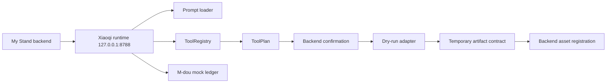

# Xiaoqi Agent Architecture

## Purpose

Xiaoqi Agent is a local-first creative director runtime for My Stand real-estate content workflows. v0.4.1 focuses on a clean Agent boundary: prompt loading, ToolRegistry validation, mock execution, M-dou mock billing, idempotent task tracking, and safe HTTP behavior.

## Runtime Shape

## Modules

- `xiaoqi.mjs`: CLI entry.
- `xiaoqi/src/cli.ts`: command parsing and server start.
- `xiaoqi/src/runtime/server.ts`: HTTP runtime and safe response handling.
- `xiaoqi/src/runtime/state.ts`: in-memory mock plan/task/billing state.
- `xiaoqi/src/prompts/loader.ts`: runtime prompt loading.
- `xiaoqi/src/contracts/toolRegistry.ts`: tool definitions and schema validation.
- `xiaoqi/src/tools/invocation.ts`: ToolPlan, invocation audit shape, input hashing.
- `xiaoqi/src/providers/`: dry-run adapter skeletons.
- `xiaoqi/src/storage/artifactBridge.ts`: backend asset registration payload shape.

## HTTP Contract

- Host: `127.0.0.1`
- Port: `8788`
- Max body: 128 KiB
- Invalid JSON: `400`
- Oversized request: `413`
- Wrong method: `405`
- Runtime error: safe JSON without stack traces

## Boundaries

The runtime must not:

- Read server directories.
- Read database files, cookies, tokens, keys, or old memory files.
- Call real Providers.
- Run arbitrary shell commands.
- Write real My Stand assets.
- Create server runtime directories or system services.

## Provenance

The complete source baseline is preserved by Git commit/tag history and documented in `XIAOQI-BASELINE.md`. The active `main` branch is the clean Xiaoqi delivery surface.
