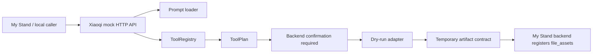

# Xiaoqi Agent Architecture

## Purpose

Xiaoqi Agent v0.4 is a local-first proof of the independent Xiaoqi runtime boundary. It keeps the upstream OpenClaw baseline available for license and source traceability, while the active local surface is the Xiaoqi entry, prompt system, ToolRegistry, dry-run adapters, mock runtime, tests, and review documents.

## Runtime Shape

The mock runtime is implemented in `xiaoqi/src/runtime/server.ts` and exposes:

- `GET /health`
- `POST /plan`
- `POST /chat`
- `POST /execute`
- `GET /status?taskId=...`

`/execute` validates the registered tool schema and returns either `awaiting_confirmation` or `dry_run_completed`. It always reports `providerCalled: false`.

## Modules

- `xiaoqi.mjs`: package binary wrapper.
- `xiaoqi/src/cli.ts`: local CLI commands.
- `xiaoqi/src/prompts/loader.ts`: runtime prompt loading.
- `xiaoqi/src/contracts/toolRegistry.ts`: tool definitions and schema validation.
- `xiaoqi/src/tools/registry.ts`: registry access helpers.
- `xiaoqi/src/tools/invocation.ts`: ToolPlan, invocation audit shape, input hashing.
- `xiaoqi/src/providers/jimeng/jimengCliAdapter.ts`: dry-run image/video adapter skeleton.
- `xiaoqi/src/providers/ffmpeg/ffmpegAdapter.ts`: whitelist-only dry-run transcode adapter.
- `xiaoqi/src/storage/artifactBridge.ts`: backend asset registration payload shape.

## Boundaries

The v0.4 runtime must not:

- Read server directories or scan full sites.
- Read SQLite, cookie, token, key, or old memory files.
- Call real Providers.
- Run arbitrary shell commands.
- Write real My Stand `file_assets`.
- Create `/opt/xiaoqi-agent`, `/var/lib/xiaoqi`, or a systemd service.

## Source Attribution

The source baseline is OpenClaw commit `738b2be4b49b0182788e70abb5454faf82407a2d`, package version `2026.6.10`, MIT license. The Xiaoqi runtime surface is the new local delta above the baseline commit/tag recorded in `XIAOQI-BASELINE.md`.
